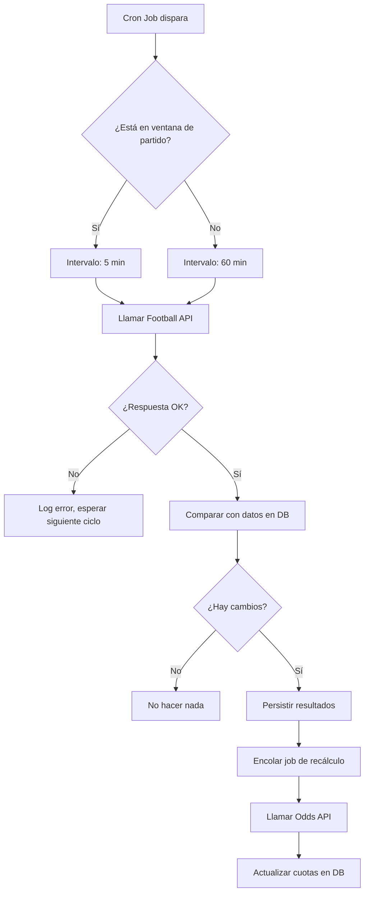

# 🏆 Plan de Acción: App Interactiva de Predicciones del Mundial

> **Estado:** Fase de Planificación  
> **Versión:** 1.0  
> **Stack tecnológico:** A definir (el sistema es agnóstico al lenguaje)

---

## Índice

1. [Visión General del Proyecto](#1-visión-general-del-proyecto)
2. [Arquitectura Conceptual](#2-arquitectura-conceptual)
3. [Desglose en Fases de Desarrollo](#3-desglose-en-fases-de-desarrollo)
4. [Prueba de Concepto (PoC)](#4-prueba-de-concepto-poc)
5. [Diagramas Recomendados Antes de Codear](#5-diagramas-recomendados-antes-de-codear)
6. [Patrones de Diseño Clave](#6-patrones-de-diseño-clave)
7. [Recomendaciones de Stack Tecnológico](#7-recomendaciones-de-stack-tecnológico)
8. [Riesgos y Mitigaciones](#8-riesgos-y-mitigaciones)
9. [Glosario Técnico](#9-glosario-técnico)

---

## 1. Visión General del Proyecto

### ¿Qué construimos?

Una aplicación web interactiva donde los usuarios predicen los clasificados de cada grupo del Mundial de Fútbol y reciben retroalimentación matemática sobre la probabilidad real de que sus predicciones ocurran.

### Propuesta de valor central

El sistema no es solo un gestor de pronósticos. Es un **motor de probabilidades** que:

- Consume cuotas de casas de apuestas y las convierte a probabilidades implícitas.
- Calcula la probabilidad combinada de la predicción completa del usuario.
- Actualiza dinámicamente esas probabilidades a medida que avanza el torneo.

### Fórmulas base del dominio

**Probabilidad implícita de una cuota decimal:**

```
Probabilidad (%) = (1 / Cuota) × 100
```

**Probabilidad combinada de eventos independientes (predicción completa):**

```
P(A ∩ B ∩ ... ∩ N) = P(A) × P(B) × ... × P(N)
```

> **Ejemplo:** Si el usuario predice que Brasil saldrá 1ro del Grupo G (cuota 1.50 → 66.7%) y Argentina 1ra del Grupo C (cuota 1.30 → 76.9%), la probabilidad combinada de que ambas predicciones sean correctas es 66.7% × 76.9% ≈ **51.3%**.

---

## 2. Arquitectura Conceptual

El sistema se compone de tres capas principales, **desacopladas entre sí** para garantizar mantenibilidad, resiliencia ante cambios de proveedor y control sobre los rate limits de las APIs gratuitas.

```
┌─────────────────────────────────────────────────────────┐
│                    CAPA DE INGESTA                       │
│  Worker / Cron Job                                       │
│  ┌──────────────┐    ┌──────────────┐                   │
│  │ Adapter API  │    │ Adapter Odds │                   │
│  │  Football    │    │     API      │                   │
│  └──────┬───────┘    └──────┬───────┘                   │
│         └──────────┬────────┘                            │
│              Base de Datos Propia                        │
└──────────────────────────────────────────────────────────┘
                         │
                         ▼
┌─────────────────────────────────────────────────────────┐
│                  CAPA DE NEGOCIO                         │
│   Motor de Probabilidades / API Interna REST o GraphQL  │
└──────────────────────────────────────────────────────────┘
                         │
                         ▼
┌─────────────────────────────────────────────────────────┐
│                  CAPA DE PRESENTACIÓN                    │
│         Frontend Web (SPA o SSR)                        │
└──────────────────────────────────────────────────────────┘
```

### Principio de diseño crítico: Desacoplamiento de la ingesta

> La interfaz de usuario **nunca** llama directamente a las APIs externas. Siempre consume datos de la base de datos propia, previamente poblada por el worker automatizado.

Este principio resuelve:
- Los **rate limits** de los planes gratuitos.
- La **disponibilidad** de la app si una API externa cae.
- La **consistencia** de datos durante un partido en vivo.

---

## 3. Desglose en Fases de Desarrollo

### Fase 0 — Preparación y Andamiaje (Semana 1)

> **Objetivo:** Tener el entorno listo y las decisiones de arquitectura tomadas antes de escribir código de negocio.

| Tarea | Descripción | Entregable |
|---|---|---|
| 0.1 Definir stack | Elegir lenguaje, framework de backend, frontend y base de datos | ADR (Architecture Decision Record) documentado |
| 0.2 Configurar entorno | Repositorio, CI básico, linting, variables de entorno | Repo con pipeline verde |
| 0.3 Registrar cuentas API | API-Football o Football-Data.org + The Odds API | API keys válidas en `.env` |
| 0.4 Diseñar esquema DB | Modelar entidades: `teams`, `groups`, `matches`, `odds`, `user_predictions` | Diagrama ER aprobado |
| 0.5 Armar diagramas | Ver Sección 5 | Diagramas en el repo |

**Criterio de salida:** El equipo puede correr el proyecto localmente y tiene claridad sobre la arquitectura.

---

### Fase 1 — MVP Core (Semanas 2–4)

> **Objetivo:** Un sistema funcional end-to-end donde el usuario puede seleccionar sus predicciones y ver probabilidades calculadas correctamente. Los datos son estáticos (pre-cargados antes del torneo).

#### Sub-fase 1A: Ingesta de Datos (Backend)

| Tarea | Descripción |
|---|---|
| 1A.1 Implementar Adapter de Football API | Clase/módulo que abstrae la llamada HTTP y mapea la respuesta al modelo interno |
| 1A.2 Implementar Adapter de Odds API | Ídem para cuotas decimales |
| 1A.3 Crear servicio de ingesta manual | Script o endpoint admin que puebla la DB con grupos, equipos y cuotas iniciales |
| 1A.4 Seedear base de datos | Correr la ingesta antes del inicio del torneo |

#### Sub-fase 1B: Motor de Probabilidades (Backend)

| Tarea | Descripción |
|---|---|
| 1B.1 Función: cuota → probabilidad implícita | `prob = (1 / odd) * 100` |
| 1B.2 Función: normalización de margen | Opcional: remover el vigorish/overround de la casa |
| 1B.3 Función: probabilidad combinada | Producto de probabilidades independientes |
| 1B.4 Endpoint `POST /predictions/calculate` | Recibe predicciones del usuario, devuelve probabilidad total |

#### Sub-fase 1C: API Interna REST

| Tarea | Descripción |
|---|---|
| 1C.1 `GET /groups` | Retorna los 8 grupos con equipos |
| 1C.2 `GET /groups/:id/odds` | Retorna cuotas actuales para ese grupo |
| 1C.3 `POST /predictions` | Persiste las predicciones del usuario |
| 1C.4 `GET /predictions/:userId` | Recupera predicciones y su probabilidad calculada |

#### Sub-fase 1D: Frontend

| Tarea | Descripción |
|---|---|
| 1D.1 Pantalla de grupos | Grilla con los 8 grupos del Mundial |
| 1D.2 Selector de predicción | Para cada grupo, el usuario elige el 1ro y 2do clasificado |
| 1D.3 Panel de resultado | Muestra la probabilidad acumulada de toda la predicción |
| 1D.4 Desglose por grupo | Cada grupo muestra la probabilidad individual de esa elección |

**Criterio de salida de Fase 1:** Un usuario puede ingresar, seleccionar sus predicciones para los 16 equipos clasificados (1ro y 2do de cada uno de los 8 grupos) y ver la probabilidad matemática combinada de que su pronóstico sea correcto.

---

### Fase 2 — Evolución Dinámica (Durante el torneo)

> **Objetivo:** La app refleja el estado real del torneo en tiempo cuasi-real, recalculando probabilidades a medida que se juegan partidos.

#### Sub-fase 2A: Worker de Ingesta Automática

| Tarea | Descripción |
|---|---|
| 2A.1 Implementar Cron Job / Worker | Proceso que se ejecuta periódicamente (ej. cada 5–15 min durante partidos, cada hora fuera) |
| 2A.2 Lógica de sincronización de resultados | Llamar a la Football API, persistir resultados nuevos |
| 2A.3 Lógica de actualización de odds | Llamar a Odds API, actualizar cuotas vigentes |
| 2A.4 Mecanismo de idempotencia | Evitar duplicados si el worker se ejecuta dos veces en el mismo estado |

#### Sub-fase 2B: Recálculo Dinámico

| Tarea | Descripción |
|---|---|
| 2B.1 Trigger de recálculo | Al persistir nuevos resultados, encolar un job de recálculo |
| 2B.2 Lógica de grupos ya definidos | Si un grupo ya está resuelto, sus probabilidades pasan a 0% o 100% |
| 2B.3 Propagación a octavos, cuartos, etc. | Calcular probabilidades de avance en fases eliminatorias |
| 2B.4 Endpoint `GET /predictions/:userId/status` | Devuelve el estado actualizado de la predicción (cuántas acertadas, probabilidad restante) |

#### Sub-fase 2C: UX Dinámica

| Tarea | Descripción |
|---|---|
| 2C.1 Indicador de resultados en vivo | Mostrar partidos en curso y resultados ya definidos |
| 2C.2 Actualización automática del frontend | Polling o WebSocket para refrescar probabilidades sin recargar |
| 2C.3 Historial de predicciones | Comparar predicción del usuario vs. resultado real |
| 2C.4 Tabla de líderes (opcional) | Ranking de usuarios por precisión de predicciones |

**Criterio de salida de Fase 2:** El sistema actualiza automáticamente las probabilidades de los usuarios a medida que avanzan los partidos, sin intervención manual.

---

## 4. Prueba de Concepto (PoC)

> La PoC tiene un único objetivo: **validar que podés conectarte a las APIs y entender la estructura real de sus respuestas.** No construyas nada productivo todavía.

### Alcance estricto de la PoC

- [ ] Hacer una request a **Football-Data.org** o **API-Football** y obtener los grupos/equipos del Mundial actual.
- [ ] Hacer una request a **The Odds API** y obtener cuotas decimales para los clasificados de un grupo.
- [ ] Imprimir en consola la estructura JSON cruda de ambas respuestas.
- [ ] Calcular manualmente (en código) la probabilidad implícita de una cuota de prueba.

### Lo que NO es parte de la PoC

- Base de datos.
- Frontend.
- Patrones de diseño o adapters.
- Autenticación.

### Preguntas que la PoC debe responder

1. ¿La API de fútbol gratuita tiene los datos del Mundial que necesito (grupos, fechas, resultados)?
2. ¿La Odds API incluye mercados de "clasificación de grupos" (no solo resultados de partidos individuales)?
3. ¿Las cuotas están en formato decimal o hay que convertirlas?
4. ¿Cuántas requests por día/mes permite el plan gratuito y es suficiente para el worker?
5. ¿La estructura de datos es estable o varía entre torneos/competencias?

### Script de PoC sugerido (pseudocódigo)

```
// 1. Obtener grupos del Mundial
response_football = GET "https://api.football-data.org/v4/competitions/WC/groups"
  headers: { "X-Auth-Token": API_KEY }
print(response_football.raw_json)

// 2. Obtener cuotas para un mercado de clasificación
response_odds = GET "https://api.the-odds-api.com/v4/sports/soccer_fifa_world_cup/odds"
  params: { apiKey: ODDS_KEY, markets: "h2h", regions: "eu", oddsFormat: "decimal" }
print(response_odds.raw_json)

// 3. Calcular probabilidad de una cuota de prueba
odd = 2.50  // ejemplo
prob = (1 / odd) * 100
print("Probabilidad implícita:", prob, "%")
```

### Entregable de la PoC

Un documento de no más de una página respondiendo las 5 preguntas anteriores, con ejemplos de la estructura JSON real de cada API.

---

## 5. Diagramas Recomendados Antes de Codear

Antes de escribir una sola línea de código productivo, construí estos diagramas. Te ahorrarán refactors costosos.

### Diagrama 1: Arquitectura de Alto Nivel (obligatorio)

**Tipo:** Diagrama de componentes o C4 Level 2  
**Qué mostrar:** Las tres capas (Ingesta, Negocio, Presentación), sus relaciones, y las APIs externas como actores fuera del sistema.  
**Herramienta sugerida:** draw.io, Excalidraw, o Mermaid en el README.

**Por qué es crítico:** Deja claro desde el día 1 que la UI nunca habla con APIs externas directamente. Evita que alguien "tome un atajo" más adelante.

### Diagrama 2: Flujo de Ingesta de Datos (obligatorio)

**Tipo:** Diagrama de flujo (flowchart)  
**Qué mostrar:** El ciclo completo del worker: trigger → llamada a API externa → validación → persistencia → fin. Incluir el manejo de errores y el control de rate limits.  
**Herramienta sugerida:** Mermaid



### Diagrama 3: Modelo de Datos Entidad-Relación (obligatorio)

**Tipo:** Diagrama ER  
**Qué mostrar:** Las entidades centrales y sus relaciones.

```
Tournament (1) ──< Group (8) ──< Team (4 per group)
Group (1) ──< Match (6 per group)
Match (1) ──< MatchOdd (cuotas de ese partido)
User (1) ──< UserPrediction (1 por torneo)
UserPrediction (1) ──< PredictionItem (1 por grupo: 1ro y 2do elegido)
```

**Por qué es crítico:** Define el vocabulario común del equipo. Antes de discutir código, todos deben acordar qué es un `Match`, un `Odd`, y un `PredictionItem`.

### Diagrama 4: Flujo de Usuario Principal (recomendado)

**Tipo:** User flow o secuencia  
**Qué mostrar:** Los pasos que sigue el usuario desde que entra a la app hasta que ve su probabilidad calculada. Incluir los llamados entre frontend, API interna y base de datos.

### Diagrama 5: Patrón Adapter para APIs Externas (recomendado)

**Tipo:** Diagrama de clases (simplificado)  
**Qué mostrar:** La interfaz `FootballDataProvider` y sus implementaciones concretas (`FootballDataOrgAdapter`, `ApiFootballAdapter`). Demostrar cómo el servicio de negocio solo conoce la interfaz, no las implementaciones.

---

## 6. Patrones de Diseño Clave

### Adapter — Para integraciones con APIs externas

**Problema que resuelve:** Si Football-Data.org cambia su estructura de respuesta o decidís migrar a API-Football, no querés tocar la lógica de negocio.

**Estructura:**

```
Interface: FootballDataProvider
  + getGroups(tournamentId): Group[]
  + getMatches(groupId): Match[]
  + getResults(matchId): MatchResult

Implementación A: FootballDataOrgAdapter
  // Traduce la respuesta de football-data.org al modelo interno

Implementación B: ApiFootballAdapter  
  // Traduce la respuesta de api-football.com al modelo interno

Servicio de Ingesta
  // Solo conoce FootballDataProvider, no las implementaciones concretas
```

### Proxy — Para control de rate limits

**Problema que resuelve:** Las APIs gratuitas tienen límites de requests. El Proxy puede cachear respuestas recientes y bloquear llamadas redundantes.

**Estructura:**

```
Interface: OddsProvider
  + getOdds(matchId): Odd[]

Implementación real: TheOddsApiClient
  // Hace la llamada HTTP real

Proxy: CachedOddsProxy
  // Verifica si hay datos en caché con menos de X minutos de antigüedad
  // Si sí → devuelve caché
  // Si no → llama al cliente real y actualiza caché
```

### Strategy — Para el motor de probabilidades (Fase 2)

**Problema que resuelve:** El cálculo de probabilidad puede evolucionar. Quizás en Fase 2 incorporás modelos más sofisticados (ELO, regresión histórica). El patrón Strategy permite intercambiar el algoritmo sin tocar el código cliente.

```
Interface: ProbabilityCalculator
  + calculate(odds: Odd[]): number

Implementación A: ImpliedProbabilityCalculator
  // Usa solo 1/odd

Implementación B: MarginAdjustedCalculator
  // Remueve el overround de la casa
```

---

## 7. Recomendaciones de Stack Tecnológico

> **Nota:** Estas son sugerencias para que evalúes, no decisiones tomadas. El sistema es agnóstico al lenguaje. Lo que importa es que el stack que elijas soporte nativamente: tareas en segundo plano, llamadas HTTP a APIs externas, persistencia relacional o documental, y una interfaz web reactiva.

### Opción A — Node.js + React (JavaScript full-stack)

| Componente | Tecnología |
|---|---|
| Backend / API | Node.js + Express o Fastify |
| Worker / Cron | node-cron o BullMQ (cola de jobs) |
| Base de datos | PostgreSQL + Prisma ORM |
| Frontend | React + Vite |
| Deploy | Railway, Render, o Vercel (frontend) + Railway (backend) |

**Ventajas:** Un solo lenguaje en todo el stack. Ecosistema enorme. Fácil de encontrar ayuda y librerías. Despliegue sencillo en plataformas gratuitas o de bajo costo.  
**Desventajas:** El event loop de Node no es ideal para cálculos matemáticos intensivos (aunque para las fórmulas de este proyecto es más que suficiente). Hay que disciplinarse en la arquitectura para no mezclar capas.

### Opción B — Python + React (backend Python, frontend JS)

| Componente | Tecnología |
|---|---|
| Backend / API | Python + FastAPI |
| Worker / Cron | APScheduler o Celery + Redis |
| Base de datos | PostgreSQL + SQLAlchemy |
| Frontend | React + Vite |
| Deploy | Fly.io o Railway |

**Ventajas:** Python es el lenguaje más natural para cálculos matemáticos y estadísticos. FastAPI genera documentación automática (OpenAPI). Celery es la solución más robusta para workers asincrónicos si el proyecto escala. Si la Fase 2 incorpora modelos más complejos (regresión, machine learning), Python ya tiene el ecosistema listo (numpy, scipy, scikit-learn).  
**Desventajas:** Dos lenguajes en el stack (Python para backend, JS para frontend). Celery + Redis agrega complejidad de infraestructura.

### Opción C — Go + React (alto rendimiento, stack más avanzado)

| Componente | Tecnología |
|---|---|
| Backend / API | Go + Chi o Gin |
| Worker / Cron | goroutines + cron nativo |
| Base de datos | PostgreSQL + sqlc o pgx |
| Frontend | React + Vite |
| Deploy | Fly.io |

**Ventajas:** Rendimiento excepcional. Los workers en Go son triviales de implementar con goroutines. Binarios compilados sin dependencias. Excelente para un sistema con alto I/O concurrente (muchos usuarios durante partidos en vivo).  
**Desventajas:** Curva de aprendizaje más pronunciada. Ecosistema de librerías más pequeño que Node o Python. Puede ser sobredimensionado para un MVP.

### Tabla comparativa rápida

| Criterio | Node.js | Python | Go |
|---|---|---|---|
| Facilidad de inicio | ⭐⭐⭐ | ⭐⭐⭐ | ⭐⭐ |
| Ecosistema matemático | ⭐⭐ | ⭐⭐⭐ | ⭐⭐ |
| Workers asincrónicos | ⭐⭐ | ⭐⭐⭐ | ⭐⭐⭐ |
| Rendimiento en producción | ⭐⭐ | ⭐⭐ | ⭐⭐⭐ |
| Escalabilidad Fase 2 | ⭐⭐ | ⭐⭐⭐ | ⭐⭐⭐ |
| Velocidad de desarrollo MVP | ⭐⭐⭐ | ⭐⭐⭐ | ⭐⭐ |

**Recomendación pragmática:** Si el equipo tiene experiencia JavaScript, ir con Opción A. Si hay familiaridad con Python o se anticipa que la Fase 2 incluirá modelos estadísticos más complejos, Opción B es la más sólida a largo plazo.

---

## 8. Riesgos y Mitigaciones

| Riesgo | Probabilidad | Impacto | Mitigación |
|---|---|---|---|
| La API gratuita no tiene los mercados de cuotas de "clasificación de grupos" | Media | Alto | Validar en la PoC (Sección 4). Tener alternativa: calcular probabilidades desde cuotas de partidos individuales. |
| Rate limit agotado durante partidos en vivo | Alta | Alto | Worker con caché. Lógica de backoff exponencial. Considerar upgrade a plan pago si el proyecto crece. |
| Cambio en la estructura de respuesta de una API | Baja | Medio | Patrón Adapter aísla el impacto. Tests de integración sobre los adapters. |
| El torneo no tiene cuotas actualizadas en tiempo real | Media | Medio | Fallback a probabilidades históricas basadas en el ranking FIFA. |
| Deuda técnica por apuros de tiempo (el torneo tiene fecha fija) | Alta | Alto | Fase 0 obliga a tomar decisiones de arquitectura antes de codear. MVP acotado a funcionalidad core. |

---

## 9. Glosario Técnico

| Término | Definición en este contexto |
|---|---|
| **Cuota decimal** | Formato de odds usado en Europa. Ej: 2.50 significa que por cada $1 apostado ganás $2.50 (ganancia + capital). |
| **Probabilidad implícita** | La probabilidad que la casa de apuestas asigna a un evento, calculada como `1/cuota`. Incluye el margen de la casa. |
| **Overround / Vigorish** | El margen de ganancia que retiene la casa. Las probabilidades implícitas de todos los outcomes de un evento suman más del 100% por esta razón. |
| **Adapter** | Patrón de diseño estructural que convierte la interfaz de una clase en otra que el cliente espera. |
| **Proxy** | Patrón de diseño estructural que actúa como intermediario para controlar el acceso a otro objeto. |
| **Worker** | Proceso en segundo plano que ejecuta tareas sin interacción del usuario, típicamente en ciclos periódicos. |
| **Cron Job** | Tarea programada que se ejecuta en intervalos definidos (ej. "cada 15 minutos"). |
| **Idempotencia** | Propiedad de una operación que puede ejecutarse múltiples veces sin producir resultados diferentes a los de la primera ejecución. |
| **Rate Limit** | Límite de cantidad de requests por unidad de tiempo impuesto por una API. |
| **ADR** | Architecture Decision Record. Documento corto que registra una decisión de arquitectura, su contexto y las alternativas consideradas. |

---

*Documento generado como punto de partida. Revisar y actualizar a medida que avanza el proyecto.*
